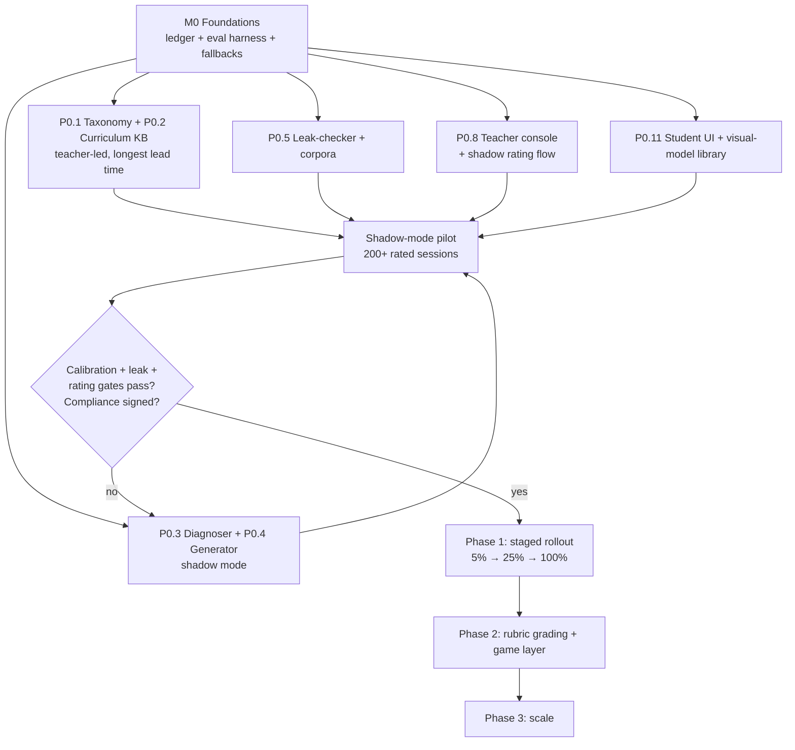

# Implementation Plan — Adaptive Socratic Tutor + Auto-Grader

Companion to [Architecture.md](Architecture.md). Section references (§) point back to that document.
The prior deterministic revision is preserved at [Architecture-deterministic.md](Architecture-deterministic.md).

**Status:** greenfield — no code exists yet.
**Architecture revision:** a model call at **every** pipeline stage — diagnosis, retrieval rerank, hint generation, leak-checking, grading, safety screening, teacher summarization.

**What that determines about this plan.** Three consequences drive the sequencing below, and they're worth stating before the task tables because every ordering decision follows from them:

1. **Evaluation is infrastructure, not a phase.** Nothing about an LLM stage can be asserted in a unit test. Quality is measured against labeled data or it is not measured, so the eval harness and the labeled set must exist *before* any model output reaches a student. This is what makes §10's Phase 0 a shadow-mode phase rather than a soft launch.
2. **The leak-checker is the highest-severity component in the system.** In the deterministic revision, answer leakage was settled at authoring time. Here it is a live risk on every request (§12). It gets its own module, its own adversarial corpus, its own version field on every hint, and release-blocking tests.
3. **Every stage needs a degradation path.** §4 requires the pipeline to keep serving students when the model provider is slow or down. The deterministic components from the prior revision — rule pre-check, keyed lookup, template hints — are therefore *built*, not skipped, and they are what Phase 0 serves students with while the models run in shadow.

---

## 0. Decisions this plan locks in

| Area | Decision | Rationale / cost to reverse |
|---|---|---|
| Language / API | Python 3.12 + FastAPI | SymPy verification, LangGraph, and the eval harness are all Python-native. Reversing after M0 rewrites the API layer only. |
| Orchestration | LangGraph, all workflow state persisted to Postgres | §4. Per-stage retries/timeouts/fallbacks are the requirement; Temporal is the higher-scale answer but heavier to operate pre-users. External state keeps a later swap a port, not a rebuild. |
| Model tiering | Haiku-class: diagnosis, rerank, leak-check, safety. Sonnet-class: hint generation. Opus-class: rubric grading, teacher summaries | §9. Tiering is the dominant cost lever, so it is structural from M0 — model IDs live in config, never inline. |
| Prompts | Versioned files in-repo, immutable once published, `prompt_version` stamped on every `LLMCall` | §8 requires quality metrics segmented by version. A prompt edited in place makes every historical metric unattributable. |
| Vector store | pgvector on the same Postgres | §9. Volumes through Phase 2 don't justify a second datastore. Behind a `CurriculumRetriever` interface so a managed DB later is a re-index. |
| Symbolic verification | SymPy in a separate FastAPI service, no network egress | §3.5 — it verifies the grader's closed-form claims, and it is where untrusted input reaches an expression evaluator. |
| Deterministic fallbacks | **Built, not skipped** — rule pre-check, keyed lookup, template hint library | §9. These are the degradation paths *and* Phase 0's student-facing path. Skipping them means shadow mode has nothing to serve. |
| Frontend | React + Vite + TypeScript, two presentation tracks over one API client (§11.3) | |
| Migrations | Alembic, forward-only; append-only tables never destructively altered | §5 audit requirement. |

**Out of scope, named so nothing is designed around it:** LMS/roster integration, multi-language (§10 Phase 3), adaptive curriculum sequencing (§10 Phase 3), any fine-tuning or training on collected data (§3.6 is explicit that the system never trains on its own outputs).

**Hard external gate:** the compliance work in §7 — DPA with the model provider, zero-retention API configuration, PII minimization, documented data flows — blocks real student data reaching the pipeline. Unlike the deterministic revision, this is not a formality; student work leaves the system boundary on every request. Start it at M0, not at pilot.

---

## 1. Repository layout

```
/
├── Architecture.md
├── Architecture-deterministic.md      # prior revision, retained for comparison
├── Implementation-Plan.md
├── services/
│   ├── api/                      # FastAPI: §6 endpoints, SSE hint stream, auth
│   ├── orchestrator/             # §4 state machine — the only caller of stage modules
│   │   ├── graph.py              #   transitions, per-stage retry/timeout/fallback
│   │   ├── state.py
│   │   └── stages/
│   │       ├── diagnose.py       # §3.1 rule pre-check → LLM
│   │       ├── retrieve.py       # §3.2 filter → embed → LLM rerank
│   │       ├── generate.py       # §3.3 hint generation
│   │       ├── leakcheck.py      # §3.3 BLOCKING guardrail — regex + classifier
│   │       └── grade.py          # §3.5 LLM rubric + symbolic verification
│   ├── symbolic/                 # §3.5 SymPy microservice, network-isolated
│   └── safety/                   # §7 distress/self-harm classifier + alert routing
├── packages/
│   ├── domain/                   # §5 entities, taxonomy enums, no I/O
│   ├── llm/                      # Claude client: tiering, retry, timeout, LLMCall logging
│   ├── prompts/                  # versioned prompt modules per stage × grade band
│   ├── fallbacks/                # rule table, keyed lookup, template library
│   └── curriculum/              # KB schema, embedding pipeline, admin authoring
├── clients/
│   ├── student/                  # §11 game client (K-5 and 6-12 tracks)
│   ├── teacher/                  # §3.6 review console + §8 dashboards
│   └── admin/                    # curriculum + prompt authoring
├── eval/                         # THE quality infrastructure — see §3 below
│   ├── datasets/                 #   teacher-labeled, versioned, held-out splits
│   ├── suites/                   #   diagnosis, retrieval, hint quality, grading
│   ├── adversarial/              #   leak corpus + prompt-injection corpus
│   └── harness/                  #   runner, scoring, regression gate
└── ops/                          # docker-compose, OTel collector, dashboards-as-code
```

**Structural rules enforced mechanically (import-linter, not review habits):**
1. Stage modules never import each other — composition happens only in `orchestrator/graph.py` (§6).
2. No stage calls the Anthropic SDK directly; everything goes through `packages/llm` so no call escapes `LLMCall` logging or tiering config.
3. No prompt string is constructed outside `packages/prompts` — otherwise version stamping silently breaks.

---

## M0 — Foundations (blocks everything)

| ID | Task | Deliverable | Done when |
|---|---|---|---|
| M0.1 | Repo scaffold, tooling | uv/poetry, ruff, mypy strict, pytest, import-linter, pre-commit, CI | CI green; the three contracts above fail the build when violated |
| M0.2 | Domain models (§5) | `packages/domain` — all 10 entities incl. `LLMCall`, `DiagnosisLog` | Round-trip tests per entity; append-only tables expose no `UPDATE` path |
| M0.3 | Migrations + seed | Alembic baseline, `pgvector` extension, docker-compose Postgres | `alembic upgrade head` from empty; 3-node fixture KB loads and embeds |
| **M0.4** | **LLM client + call ledger** | `packages/llm` — per-stage tiering, timeout, bounded retry, and a **durable `LLMCall` write for every single call** (model, prompt version, payloads, tokens, latency, cost) | An integration test proves a stage cannot make a call that leaves no ledger row. Cost/latency metrics emit per stage. |
| **M0.5** | **Eval harness** | `eval/harness` — dataset versioning, held-out splits, suite runner, scoring, regression gate wired into CI | Runs a suite against a fixture dataset and fails on regression. **Built before any stage exists** — a stage without a suite has no definition of working. |
| M0.6 | Prompt versioning | `packages/prompts` — immutable published versions, per-stage × grade-band modules, changes gated on M0.5 | Editing a published prompt is impossible; a new version requires an eval run to merge |
| M0.7 | Symbolic service skeleton | `services/symbolic` — `POST /equivalent`; no egress, no filesystem write, CPU/memory capped, per-request timeout | Egress provably blocked; hostile-input fuzzing cannot hang or exhaust memory |
| M0.8 | Event log + tracing | Append-only `pipeline_event` + OTel spans keyed by `session_id`, joined to `LLMCall` | Any session reconstructable end-to-end from the record alone (§4) |
| M0.9 | Auth + tenancy | Student/teacher/admin roles; teacher scoped to their class; `/admin/llm-calls` restricted | Authorization negatives: teacher A cannot read teacher B's queue, students, or audit trail |
| **M0.10** | **PII boundary** | Prompt-construction helper that structurally accepts only session/problem context — student identifiers are not representable in its input type | A test asserts no student name or ID can reach a prompt payload (§7). Structural, not a review checklist. |
| M0.11 | Compliance workstream **(start now)** | DPA, zero-retention/no-training API config, data-flow documentation for district review | Signed before Phase 1's live launch — see the gate below |
| M0.12 | Deterministic fallback stubs | `packages/fallbacks` — rule pre-check, keyed lookup, template hints | Each stage has a working non-model path, exercised by a "provider down" integration test |

**M0 exit criteria:** the pipeline runs end-to-end on a 3-node fixture KB with real model calls at every stage, every call ledgered, every stage falling back cleanly when the provider is stubbed to fail, and the eval harness scoring a fixture suite in CI.

> M0.4, M0.5, and M0.10 are the three that get cut under schedule pressure and shouldn't be. The ledger is the only reason a grade can be defended later (§12 nondeterminism), the harness is the only definition of "working" any LLM
 stage has, and the PII boundary is far cheaper to build into the type system now than to retrofit across seven prompts after a compliance review.

---

## Phase 0 — Shadow mode (single strand, single grade band) (§10)

**Goal:** build the labeled evaluation set and measure diagnoser calibration and leak-check performance against *real student work*, before any generated output reaches a child.

**How shadow mode works:** every session runs the full LLM pipeline. Students are served **template hints from `packages/fallbacks`**; the generated hint is logged beside it for teacher rating but never displayed. All grading is teacher-confirmed. The model is on trial; the student experience is deterministic.

**Scope:** one strand (recommend K–2 addition/subtraction within 20 — best-documented misconceptions, and §11.2's ten-frame/number-line visuals apply directly), ~10 curriculum nodes, 100% teacher review.

| ID | Task | Notes |
|---|---|---|
| P0.1 | Misconception taxonomy v1 | 12–18 tags authored **with a teacher**, per §5. Bias review at authoring time (§7): every tag names an *error pattern*, never a student trait. This is the diagnoser's constrained output vocabulary, so it gates P0.3. |
| P0.2 | Curriculum KB v1 + embeddings | 10 nodes: definition, associated tags, 2–3 approved remediation strategies, representation type (§11.2), prerequisite links. Embedded and indexed. |
| P0.3 | Diagnoser v1 | Rule pre-check → Haiku-class LLM with schema-constrained output (§3.1), incl. `alternatives[]` for ambiguity detection. |
| P0.4 | Hint generator v1 (shadow) | Sonnet-class, §3.3 constraints, grade-band prompt modules. Output logged and teacher-rated, **not displayed**. |
| **P0.5** | **Leak-checker v1 + adversarial corpus** | Both layers (§3.3): normalized equivalence match, then classifier. Corpus seeded with hand-written attacks *and* every generated hint from shadow mode that a teacher flags as leaky. Runs on shadow output so it accumulates a real failure set before going live. |
| P0.6 | Template hint library | The student-facing path this phase, and the permanent leak-fallback and outage path. 3 levels per strategy. |
| P0.7 | Symbolic grading integration | Closed-form via M0.7 (§3.5). Rubric grading deferred to Phase 2. |
| P0.8 | Teacher review console v1 | 100% review. Actions per §3.6, **plus rating the shadow hint and confirming/correcting the shadow diagnosis** — this rating flow is the phase's primary data-collection instrument, so it deserves real UX attention rather than a debug screen. |
| P0.9 | Eval datasets v1 | Teacher labels from P0.8 → versioned, split, held-out. Suites for diagnosis accuracy + calibration, hint quality (teacher rating), leak detection. |
| P0.10 | Prompt-injection corpus | §7. Student answers flow into every downstream prompt; injection attempts belong in the adversarial suite from day one, not after a student finds one. |
| P0.11 | Minimal student UI | Playable but unpolished; §11.2 visual models for the strand. Enough that pilot students behave like students. |

**Exit criteria — all required before any generated text reaches a student:**
1. ≥ 200 teacher-reviewed sessions with shadow ratings.
2. **Diagnoser calibration holds:** predictions at ≥ 0.8 confidence are ≥ 90% teacher-confirmed. Calibration, not raw accuracy, is the gate — every downstream confidence threshold is meaningless without it (§8).
3. **Leak-checker: 100% detection on the adversarial corpus, zero misses on teacher-flagged shadow hints.** Release-blocking.
4. Teachers rate shadow hints as good-or-better than the template hint in ≥ 70% of cases. If generation isn't beating templates on real student work, the cost and risk of §12 aren't yet bought.
5. Every stage's degradation path verified under a simulated provider outage.
6. **Compliance sign-off obtained (M0.11).**

> The temptation is to skip shadow mode and launch behind a confidence threshold. The reason not to: a threshold picked before you have labeled data is a guess, and the first population it's tested on is children. Shadow mode costs one phase and buys a calibrated gate, a real leak corpus, and a documented answer to "how do you know it works."

---

## Phase 1 — Diagnosis and hints go live (§10)

| ID | Task | Notes |
|---|---|---|
| P1.1 | Staged rollout | Generated hints to 5% → 25% → 100% of sessions, each step gated on leak rate, teacher rating, and escalation rate holding. Kill switch reverts to templates instantly, tested before launch, not after. |
| P1.2 | Confidence thresholds | Calibrated from P0.9's held-out set, not guessed (§3.1). Below threshold, or `alternatives` too close → `unknown` → generic Socratic hint. |
| P1.3 | Retrieval v2 | Structured filter → embedding similarity → LLM rerank reading diagnosis evidence and attempt history (§3.2). Relevance floor blocks generation on empty retrieval — the condition under which models invent curriculum. |
| P1.4 | Retrieval eval suite | Fixture set: tag → expected node. Runs with **zero model calls** for the filter/similarity layers (§4's testability claim, made real). |
| P1.5 | Hint caching | Cache by `(node, tag, hint_level, grade_band)` for cold-start hints; per-student personalization bypasses cache. §12 names cost as scaling with engagement — build this before the bill, not after. **Cached hints still pass leak-check.** |
| P1.6 | Review queue rules | 100% → low-confidence, `unknown`, max-hints, safety flags, leak-fallback events, 2% audit sample (§3.6). Runtime-configurable, tuned with teachers. |
| P1.7 | LLM teacher summaries | §3.6 triage summaries. **Navigation, never recommendation** — no suggested verdict, evidence always one click away. |
| P1.8 | Safety classifier | §7 distress/self-harm screening on a counselor/teacher alert path distinct from grading. Needs a measured false-negative rate, a defined on-call response, and student-safety sign-off. Genuinely more sensitive than the deterministic revision's keyword screen — that's a real argument for this architecture and it should be documented as one. |
| P1.9 | Feedback loop job | Teacher overrides → eval set and few-shot library (§3.6). Human approves every promotion. **Never trains on unreviewed output.** |
| P1.10 | Cost controls | Per-stage budgets, per-tenant rate limits, alerting on cost-per-session regression — a prompt change can silently double spend (§8). |

**Exit criteria:**
- Zero confirmed answer leaks in production; corpus grown with every near-miss.
- Combined diagnoser ≥ 80% agreement with teacher-confirmed tags on held-out data, calibration from P0 maintained.
- p95 diagnose→retrieve→hint **< 2s** (§8), cold and warm cache reported separately.
- Review queue ≤ 25% of sessions with no rise in escaped errors per the audit sample.
- Cost per active student inside budget and stable across a prompt version change.

---

## Phase 2 — Rubric grading + multi-turn dialogue (§10)

| ID | Task | Notes |
|---|---|---|
| P2.1 | LLM answer normalization + symbolic verification | §3.5: model canonicalizes messy input ("one and a half", "1 1/2", stray units), SymPy decides equivalence. **Disagreement always resolves to the checker** and is logged as a signal. |
| P2.2 | Rubric grader | Opus-class against teacher-authored rubrics from the KB. Returns per-criterion results **with a quoted student span supporting each judgment** — the difference between a defensible grade and an opaque one. |
| P2.3 | Two-pass agreement + routing | Independent passes; disagreement → review. Plus §3.5's consistency check: "correct" right after a diagnosed fundamental gap → review. |
| P2.4 | Grading eval suite | Teacher-graded held-out set; track auto-vs-teacher agreement, pass-1-vs-pass-2, LLM-vs-symbolic. |
| P2.5 | Rubric authoring | Teachers author rubrics where they author curriculum — same tool, same approval path. |
| P2.6 | Multi-turn hint dialogue | Full 1→3 escalation with responses between levels; at max attempts reveal the worked solution and log for review (§3.3). |
| P2.7 | Teacher analytics dashboard | §8: heatmaps, diagnoser accuracy and calibration trends, leak metrics, hint effectiveness by (node, level), cost/latency per stage, **metrics segmented by prompt version**. |
| P2.8 | Student experience layer, full | §11: reward moments, streak/combo, mastery badges from `MisconceptionTag` history, progress map = curriculum graph. Both tracks (§11.3). Includes §11.1's latency beat — generation delay reads as the mascot thinking, never as a spinner. |
| P2.9 | §11.5 UX guardrails | Pacing floors; low-stimulation mode; escalation never a loss state; text-only equivalents for screen readers; **reading-level check at request time** (§11.5 — generated copy can't be vetted once at authoring time). |

**Exit criteria:**
- Auto-grade agreement with teacher verdicts ≥ 95% on the audit sample; every disagreement class understood, not just counted.
- Rubric inter-pass agreement ≥ 90%; disagreements route rather than average.
- Zero cases of a rubric grade contradicting symbolic verification reaching a student.
- Accessibility audit passed (WCAG 2.2 AA), including the visual-model library.

---

## Phase 3 — Scale and integrate (§10)

| ID | Task |
|---|---|
| P3.1 | Extend taxonomy, KB, and prompts across full K–12 and more operation types |
| P3.2 | Cost engineering: batch precomputation of common tag→hint pairs, tier review under real traffic, cache hit-rate work — cost scales with engagement, so this is continuous, not a one-off |
| P3.3 | Evaluate Temporal migration if session volume or workflow duration justifies it |
| P3.4 | Export mastery/difficulty signals to an adaptive sequencer |
| P3.5 | Multi-language — the generative approach extends here far more cheaply than a template library, though the leak-checker needs per-language answer-form normalization and the eval sets need per-language labels |
| P3.6 | Standing bias audit: sampling-based measurement of generated hint tone against demographic proxies (§7) — harder than auditing fixed templates and needs a real methodology, not a spot check |

---

## 2. Contracts to freeze early

**Stage boundaries** (`packages/domain`, versioned):
- `DiagnosisResult` — §3.1: `misconception_tag`, `confidence`, `evidence`, `alternatives[]`, `grade_band`, `source: rule|llm`
- `RetrievalResult` — `node_id`, `strategies[]`, `representation_type`, `scores`, `used_fallback: bool`
- `HintCandidate` — `text`, `level`, `representation`, `source: generated|cached|template_fallback`
- `LeakCheckResult` — `passed`, `layer_failed`, `reason`, `checker_version`
- `GradeResult` — §5: `score`, `confidence`, `method`, `rubric_breakdown?`, `symbolic_agreed?`

Every one carries `llm_call_id` where a model produced it. That join is the audit trail.

**API** — §6 as written, with two notes:
1. `GET /sessions/{id}/hint` is **SSE**, and streams only post-leak-check text (§3.4). Streaming raw generation to a student would defeat the guardrail — the stream is a replay of approved text, not a live model pipe. Worth writing down because it's an easy and catastrophic optimization for someone to "fix" later.
2. `POST /teacher/review/{id}` mutating a `CurriculumNode` writes a version record and **triggers re-embedding** — a strategy edited without re-embedding is silently unretrievable.

---

## 3. Testing and evaluation strategy

Two distinct regimes. Conflating them is the classic failure of LLM systems: asserting model behavior in unit tests (flaky, gets deleted) or checking deterministic logic only by eyeballing outputs (untested).

**Deterministic — CI gates, hard pass/fail:**

| Layer | Gate |
|---|---|
| Domain, rule pre-check, fallbacks | ≥ 95%. Pure functions. |
| Stage modules | ≥ 85% with all model calls mocked — every stage testable with zero network |
| **Leak-checker deterministic layer** | **Adversarial corpus, 100% must-fail rate, release blocker** |
| Orchestrator | Per-transition tests incl. retry, timeout, resume-after-crash, **and provider-outage degradation for every stage** |
| Symbolic service | Property-based (hypothesis) over equivalence classes; hostile-input fuzzing against M0.7's isolation |
| `LLMCall` ledger | No code path can call a model without writing a ledger row |
| PII boundary | No student identifier is representable in a prompt payload (M0.10) |
| API | Integration per §6 endpoint incl. M0.9 authorization negatives |

**Probabilistic — eval suites, tracked and gated on regression, never asserted in CI unit tests:**

| Suite | Metric |
|---|---|
| Diagnosis | Per-tag precision/recall, `unknown` rate, **calibration curve** |
| Retrieval | Recall@k against fixture tag→node pairs |
| Hint quality | Teacher rating vs. template baseline; repetition rate across a session |
| Leak-check classifier | Detection rate on adversarial corpus, false-positive rate (drives regeneration cost) |
| Grading | Auto-vs-teacher, pass-1-vs-pass-2, LLM-vs-symbolic agreement |
| Prompt injection | Attack success rate — must be zero on the known corpus |

**Rule:** a prompt or model change merges only after an eval run showing no regression. This is the gate that catches §12's silent quality drift; nothing else will.

**Frontend:** visual regression at 320/768/1024/1440; keyboard nav; reduced-motion; screen-reader path per visual model. **E2E:** §2 happy path, leak-fallback path, `unknown` path, escalation path, teacher-override path, safety-flag path, provider-outage path.

**Repo-wide floor: 80%** on deterministic code.

---

## 4. Sequencing and parallelism



**Five tracks run concurrently after M0:** content (taxonomy + KB — teacher-led, longest lead time), pipeline (diagnoser + generator), guardrail (leak-checker + corpora), teacher-facing (console + rating flow), student-facing (UI + §11.2 visual-model library).

Three sequencing notes worth arguing about up front:

- **The eval harness (M0.5) precedes every model stage.** Building a stage before its suite means the first quality measurement happens after the code is committed and defended.
- **The visual-model library is shared between the admin tool and the student client** (§11.2). Build it once in the student track and have admin consume it, or the drift §11.2 warns about appears in week one.
- **Compliance (M0.11) starts at M0 and gates Phase 1, not Phase 0.** Shadow mode can run on a synthetic or consented cohort; live generated output to real students cannot. Starting it late is the most likely cause of a finished system that can't launch.

---

## 5. Risk register (from §12, with owning tasks)

| Risk | Mitigation | Owned by |
|---|---|---|
| **Answer leakage at request time** — the defining risk | Two-layer blocking checker, owned and versioned, adversarial corpus grown from every near-miss, 100%-detection release gate, template fallback after 2 failures, `leak_checker_version` on every hint | P0.5, testing gate, P1.1 |
| **Confident misdiagnosis** | Calibration (not accuracy) as the gate; `alternatives[]` ambiguity detection; `unknown` → generic hint; shadow mode establishes the threshold on real data | P0.3, P0.9, P1.2 |
| **Cost scales with engagement** | Rule pre-check skips the common cases; tiering structural from M0; caching in Phase 1 not post-incident; per-session cost alerting | M0.4, P1.5, P1.10, P3.2 |
| **Nondeterminism undermines audit** | `LLMCall` ledger on every call; teacher-facing grade explanations designed deliberately (§12 notes a log dump is not an explanation) | M0.4, P2.2, P2.7 |
| **Compliance / data egress** | DPA, zero-retention config, structural PII boundary, documented flows — started at M0, gating Phase 1 | M0.10, M0.11 |
| **Prompt injection from student input** | Student text delimited, never concatenated into instruction context; leak-checker runs regardless of what the generator was told; attack corpus from day one | P0.10, P0.5 |
| **Silent quality drift** | Immutable versioned prompts; eval-gated merges; §8 metrics segmented by prompt version and model ID | M0.6, P2.7, testing rule |
| **Provider outage takes the product down** | Every stage has a deterministic degradation path, exercised by an outage test in CI | M0.12, orchestrator gate |
| **Teacher trust erodes / queue noisy** | Queue rules runtime-configurable and tuned with teachers; summaries navigate rather than recommend; overrides visibly feed the eval set | P0.8, P1.6, P1.7 |
| **Curriculum drift / invented strategies** | Empty retrieval blocks generation; hints logged against their source node so drift is measurable | P1.3, P2.7 |

---

## 6. Definition of done (per component)

- [ ] Contract in `packages/domain`, versioned
- [ ] Deterministic logic unit-tested at the layer's threshold, model calls mocked
- [ ] **An eval suite exists** if the component involves a model call — no suite, not done
- [ ] Every model call writes an `LLMCall` row with model ID and prompt version
- [ ] Degradation path defined and tested for provider slowness/outage
- [ ] Emits OTel spans + cost/latency metrics keyed by `session_id`
- [ ] No student PII in any prompt (structurally enforced, M0.10)
- [ ] Session reconstructable from the record alone
- [ ] Reviewed by `code-reviewer`; `security-reviewer` additionally for student input handling, auth, prompt construction, and the symbolic service

---

## 7. Open questions needing a human decision

1. **Which strand for Phase 0?** K–2 addition/subtraction within 20 is the recommendation. Needs a teacher's agreement.
2. **Shadow-mode cohort:** real students under consent, or synthetic? This decides whether M0.11's compliance work gates Phase 0 or only Phase 1, and it's the difference of roughly a phase in schedule.
3. **Model provider terms:** zero-retention and no-training configuration for student data needs confirming against the actual contract before P0 sends a single real student answer.
4. **Cost ceiling per active student per month.** §12 flags cost scaling with engagement; without a number, P1.10's budgets and P3.2's tiering work have no target to hit.
5. **Does the referenced Numeria codebase exist and is it reusable?** §11.2 calls its SVG generators a natural starting point for the shared visual-model library. If reusable, P0.11 shortens materially; if not, the library is net-new. Nothing in this repo confirms either way.
6. **Who owns the leak-checker?** §12 makes it the highest-severity component, and a component with release-blocking authority needs a named owner, not a shared one.
